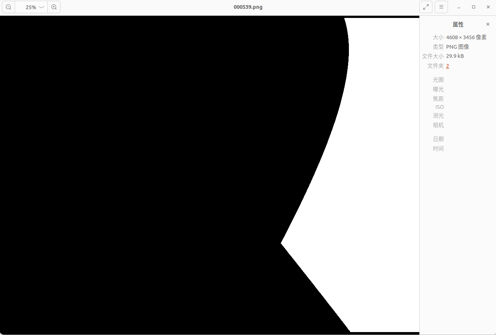

# mega-nerf-mask-cuda
[mega-nerf](https://github.com/cmusatyalab/mega-nerf) will use ```create_cluster_masks.py``` to mask all images after dividing the region into blocks.This process will take a considerable amount of time and memory.So I use cuda with pybinding to optimize it.<br>
The algorithm in ```create_cluster_masks.py``` can be summarized as:<br>
Let space $V$ be evenly divided into $N_{grad}$ sub regions $G=\{g_1,g_2,...,g_{N_{grad}}\}$, where $g_i=(c_i,s_i)\in R^{2\times3}$. Given the camera's pose $c2w=\{[R_1|t_1],...,[R_M|t_M]\}$, several rays $r=\{r_{1,1},...,r_{W,H}\}$ can be generated that pass through the pixel coordinates $(u,v,1)^T$ and the camera's optical center $o$:<br>
&emsp;1.Sample $N_{sample}$ points $p=\{p_1,...,p_{N_{sample}}\}$ for $r_{u,v}$ a and calculate $d(p,c)$,where $d(x,y)=||x-y||_2^2$<br>
&emsp;2.Let $d_i^*=\min_j\{d(p_i,c_j)\},ratio_j=\min_i\frac{d(p_i,c_j)}{d_i^\*}$,  If $ratio_j \leq T$, then mask is True for $(u,v)$ of $g_i$


# Install
```
git clone git@github.com:will-zzy/mega-nerf-mask-cuda.git
cd mega-nerf-mask-cuda
cd csrc
python setup.py install
```
# Use
this repo takes one whole image as input, while mega-nerf dose in batches. So thie repo just uses 1~2 hours to mask all images, while mega-nerf takes 8~11 hours on one A5000;<br>
```maskStudio.mega_nerf_mask``` need<br>
```dirsMap``` : means rays_d, shape = [W*H , 3],<br>
```localMap``` : means rays_o, shape = [W*H , 3],<br>
```centroids``` : means centroid of each grid, shape = [clusters , 3],<br>
```t_range``` : means t_min and t_max, shape = [W*H , 2],<br>
```samples``` : means num of sample points in one ray, dtype = int,<br>
```threshould``` : means overlapping areas ratio of various parts, dtype = float,<br>
as input. And take ```mask``` as output(shape=[WxH , 1],dtype = torch.int32) <br>
You can also use it in ```create_cluster_masks.py``` like in demo.py<br>
There is almost no deviation:
<p align="center">
  
</p>


